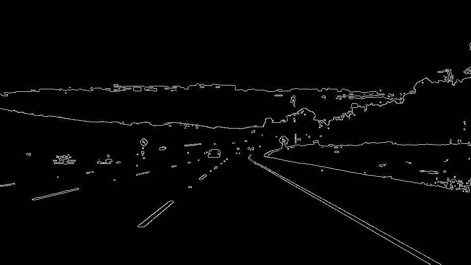

#**Finding Lane Lines on the Road** 

## Introduction

The goal of this project was to identify lane lines on a road using a
combination of computer vision techniques. Specifically the input to the
pipeline is a series of images and the output is a new image with transparent
lines overlayed on the lane lines.

## Reflection

### 1. Pipeline Description

My pipeline consists of 7 steps. These steps are detailed below. Example images
for some stages in the pipeline are based on the input image below:

1. Add contrast to the image.

   The colors in the image are adjusted so that yellow'ish and white'ish pixels
   are made very white, where the definitions of yellow and white are those pixels
   having RGB values above a given hreshold. Also, pixels darker than the white
   threshold are painted black to give the image an incrased amount of contrast.
   
   
   
   This step takes the place of using a gaussian blur to blur the image and in
   fact from my experiments, the approach of adding contrast seems to do a
   better job where the surface of the road changes color as it does in the
   challenge video.

2. Grayscale the image.
   
   

3. Detect edge using a canny edge detector.

   The grayscaled and gaussian blurred image is then given as input to
   a canny edge detector to find edges.
   
   
   
4. Mask edges

   Edges outside of a region of interest, which is defined as the region where
   we expect to find the lane lines are masked out.

5. Hough Line Detection

   The masked edges detected by the canny edge detector are then
   converted to lines using a hough line detection algorithm.
   
   

   The area delimited by the blue quadrilateral is the area of interest.
   
6. Calculate Lane Lines

   The lines produced by the hough line detection algorithm are then converted
   to two lines, one for each lane, by averaging the slopes and the centers of
   each line. Lines having a negative slope are categorized as belonging to the
   left lane, while lines having a positive slope are categorized as belonging
   to the right lane.
   
7. Overlay Lanes on Input Image

   After determining the average slopes and centers of each lane line, the
   actual lane line for each lane is calculated using the point-slope formula
   for a line.
   
   

The following diagram illustrates how my pipeline works:

### 2. Potential shortcomings of the pipeline

My pipeline has the following short-comings:

* It would not handle roads with sharp curves

  The pipeline assumes that the lane lines can be approximated by a
  straightline which would not be the case for a sharp curve.

* It would likely not handle cases where other cars/vehicles are close in front.

  One particularly pathological case would be doing lane line detection while
  following somewhat closely behind a large truck. In this case the edges of
  the back of the truck would likely have the right slope to be treated as
  lane lines and throw things off.

* It would probably do badly on sections of road with other markings in the middle of the road.

  On some roads, diagonal lines are used to delineate a section of the road
  where it is not allowed to stop. This would most certainly confuse my
  pipeline since these diagonal lines would have approximately the right slope
  to be considered lane lines.

* It would likely not handle the car making a sharp turn across a road

  In the same way that sharp curves would not be handled, if the car turned
  sharply the lane lines would go undetected because the pipeline looks for
  lines having a pre-determined slope and discards lines outside that range.

* Lane lines are a bit jittery

  When viewing the videos the lane lines jitter back and forth quite a bit.

* Pipeline can fail to detect a lane line

  This can happen in cases where all of the lines for a given lane line are
  outside the pre-defined range of slopes.

* The pipeline could be made to be more efficient

  In order to add contrast to the image, the color_pixels function is called
  three times. These calls could be combined into one by checking categorizing
  each pixel in a single pass. This would reduce the number of memory
  allocations since color_pixels makes a copy of the image on each call.

### 3. Possible pipeline improvements

* Modify pipeline to handle lines with sharper curves

  Instead of modelling a lane line as a straight line, the pipeline could be
  modified to model a lane line as a curve. Perhaps one way of doing this would
  be to modify the hough line detection minimum line length parameter to be
  smaller and then treat each line as a section of a curve. The start and end
  points of each line would be treated as points on the curve of either the
  left or right lane line according to their slope and would be used to produce
  an average radius and center point.

* Use multiple regions of interest to reduce noise

  The pipeline uses a single region of interest to ignore uninteresting edges.
  One problem I observed with the challenge video is that dealing with the
  noise from the shadows is difficult. One possible solution would be to use
  multiple regions of interest to filter out uninteresting edges which should
  reduce noise.

* Reduce lane line jitter using a smoothing function

  To reduce the jitter in the lane lines, the output lane lines could be run
  through a smoothing function to "dampen" the movement from one frame to the
  next.

* Use a predictive function to predict where a lane line should be for cases where one is not detected

  One option I was thinking about here would be to use a Kalman filter to
  predict where the lane line should be based on past samples.
